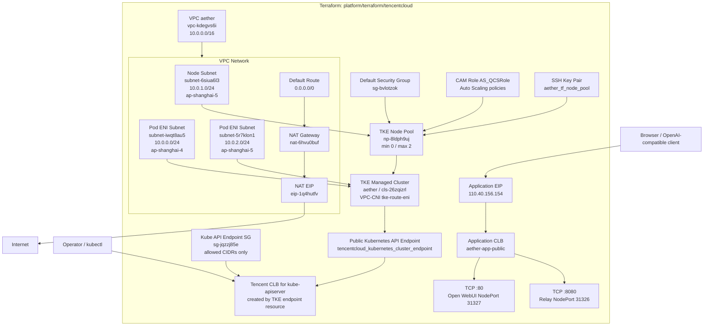
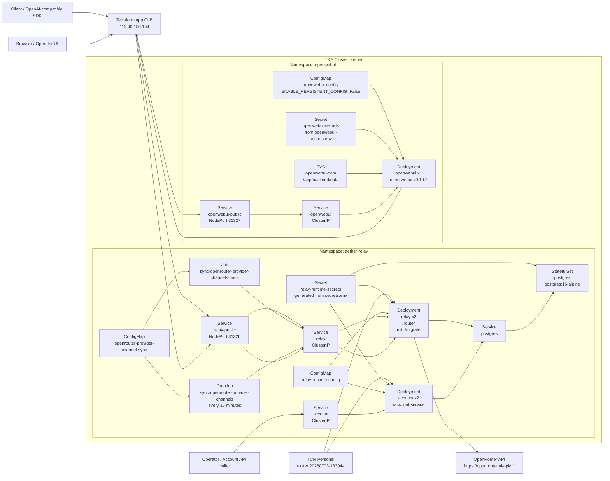

# Aether Code

Aether编程工具及其中转站

## Feature

- 使用go构建，低延迟高吞吐
- 自动选择渠道，动态计费
- 比一般中转站更高的缓存命中率

## 基建架构

当前部署分为两层 IaC：

- Terraform：`platform/terraform/tencentcloud`，管理腾讯云基础设施、TKE
  集群底座，以及一个 EIP-backed 业务公网 CLB。
- Kubernetes：`platform/k8s/tke`，管理 TKE 内的应用运行时。Relay 和
  Open WebUI 通过固定 `NodePort` 暴露给 Terraform 管理的业务 CLB。

完整部署 runbook 见 [platform/RUNBOOK.md](platform/RUNBOOK.md)。

### Terraform 管理层

说明：

- `tencentcloud_kubernetes_cluster_endpoint.aether_public` 会间接创建一个
  kube-apiserver 公网 CLB；它只用于 Kubernetes API，不承载业务流量。
- Terraform 直接管理业务公网入口 `aether-app-public`，避免腾讯云默认
  CLB 域名拦截。
- TCR Personal 镜像仓库
  `ccr.ccs.tencentyun.com/aethercode-100034871923/router` 目前由文档记录，
  不在 Terraform state 中。

### Kubernetes 运行层

业务入口：

- Open WebUI: `https://openwebui.n0n4w3.cn`
- Relay OpenAI-compatible base URL: `https://relay.n0n4w3.cn/v1`
- Account service: 默认不公开，通过集群内 `account.aether-relay.svc.cluster.local` 访问。

Owner 边界：

- `relay-public`、`openwebui`、`openwebui-public` 是 K8s manifest 管理的
  `NodePort` Service。
- 业务公网 EIP/CLB/listener/后端 attachment 由 Terraform 管理。
- kube-apiserver 公网 CLB 是 TKE 控制面入口，不承载 relay/Open WebUI。
- Open WebUI 当前通过公网 relay listener 调用 relay；设置域名后可把
  `OPENAI_API_BASE_URL` 改为域名形式。
- OpenRouter provider channel 配置由
  `sync-openrouter-provider-channels` CronJob 每 15 分钟按声明式配置纠偏。
