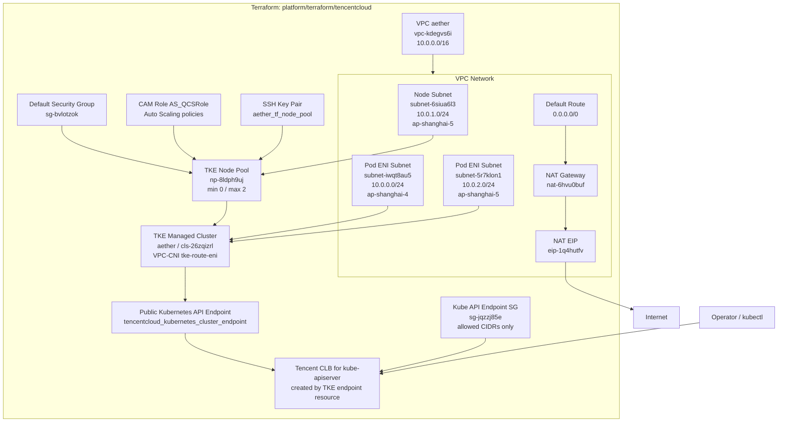
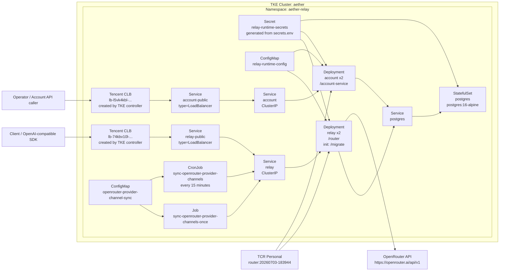

# Aether Code

Aether编程工具及其中转站

## Feature

- 使用go构建，低延迟高吞吐
- 自动选择渠道，动态计费
- 比一般中转站更高的缓存命中率

## 基建架构

当前部署分为两层 IaC：

- Terraform：`platform/terraform/tencentcloud`，管理腾讯云基础设施和 TKE
  集群底座。
- Kubernetes：`platform/k8s/tke`，管理 TKE 内的应用运行时，并通过
  `Service type=LoadBalancer` 让 TKE 控制器创建业务 CLB。

完整部署 runbook 见 [platform/RUNBOOK.md](platform/RUNBOOK.md)。

### Terraform 管理层

说明：

- Terraform 不直接定义业务 CLB。
- `tencentcloud_kubernetes_cluster_endpoint.aether_public` 会间接创建一个
  kube-apiserver 公网 CLB。
- TCR Personal 镜像仓库
  `ccr.ccs.tencentyun.com/aethercode-100034871923/router` 目前由文档记录，
  不在 Terraform state 中。

### Kubernetes 运行层

业务入口：

- Relay:
  `http://lb-74kbv10l-5xczlkyth7osdqr8.clb.sh-tencentclb.com/v1`
- Account:
  `http://lb-l5vk4kbl-i1jarzn7ckm3sf2o.clb.sh-tencentclb.com`

Owner 边界：

- `relay-public` 和 `account-public` 是 K8s manifest 管理的 Service。
- 对应两个业务 CLB 由 TKE cloud controller 根据 Service 自动创建、更新
  和回收，不应再用 Terraform 单独接管。
- OpenRouter provider channel 配置由
  `sync-openrouter-provider-channels` CronJob 每 15 分钟按声明式配置纠偏。
